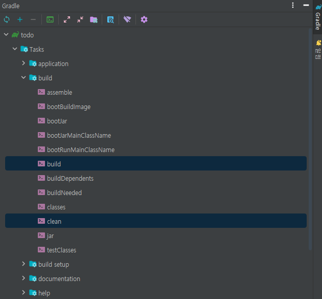
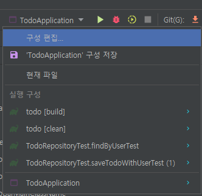
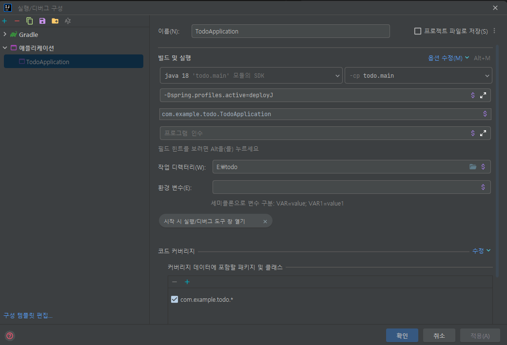

# 중요
실무에서는 properties 파일 Git에 업로드 금지

# 순서
(2023-01-18)
1. https://start.spring.io/ 에서 프로젝트 다운로드
2. main/java/com/example/todo/TodoApplication.java - 톰캣 실행 (오류 발생)
3. main/resources/application.properties - 데이터베이스 연결
4. 톰캣 재실행 (오류 X)
5. Help.md 를 README.md 로 변경
6. .gitignore 에서 README.md 라고 써있는 줄 지우기
7. 설정->빌드,실행,배포->컴파일러) 프로젝트 자동 빌드 [체크]
8. 설정->고급설정->개발된 애플리케이션이 현재 실행중인 경우에도 auto-make 가 시작되도록 허용 [체크]
9. main/java/com/example/todo/HealthCheckController.java 생성 후 작성
10. http://localhost:8080/ 입력해보고 server is running... 뜨는지 확인
11. 상단 VCS -> github 에 프로젝트 공유
12. main/java/com/example/todo/todoapi/entity/TodoEntity.java 생성
13. 깃에 todo entity 생성이라고 올림
14. main/java/com/example/todo/todoapi/repository/TodoRepository.java (interface) 생성 후 작성
15. Ctrl + Shift + t 로 TodoRepository의 테스트파일 생성 후 작성 (TodoRepositoryTest.java)
16. main/java/com/example/todo/todoapi/service/TodoService.java 생성 후 작성
17. main/java/com/example/todo/todoapi/dto/response/TodoListResponseDTO.java 및 TodoDetailResponseDTO 생성 후 작성
18. main/java/com/example/todo/todoapi/dto/request/TodoCreateRequestDTO.java 생성 후 작성
19. main/java/com/example/todo/todoapi/dto/request/TodoModifyRequestDTO.java 생성 후 작성
20. Ctrl + Shift + t 로 TodoService의 테스트파일 생성 후 작성 (TodoRepositoryTest.java)
21. main/java/com/example/todo/todoapi/controller/TodoApiController.java 생성 후 작성

---
http://localhost:8080/join  GET    <=== join.html

http://localhost:3000/signup      <=== Join.js 라우팅

http://localhost:8080/signup    <=== 회원가입 요청

http://localhost:3000/login     <=== Login.js 라우팅

---
```
JWT{
    "sub" : 토큰 식별값,   
    "iss" : 토큰 발급자 정보,  
    "iat" : 언제발급했는지 시간정보,   
    "exp": 토큰 만료시간
}
서명 (위조확인)
```
---
공통 코드 처리 (로그 출력, 요청헤더 파싱, 세션 검사, 쿠키 검사)
1. 필터 : 프론트 컨트롤러 앞에서 작동
2. 인터셉터 : 하위 컨트롤러 앞뒤에서 작동
3. AOP : 각 메서드 앞뒤에도 작동
---

## 빌드
### JAR 배포 설정 (기본 세팅)

- 방법 1: 터미널에서 실행
```
./gradlew build
```
-> 테스트를 먼저 돌림 (시간이 지나도 구조가 변하지 않는 테스트로 만들어야 함)

-> 빌드 시 테스트 하지 않도록
build.gradle 파일 수정

```
// build.gradle(todo)
tasks.named('test') {
//	useJUnitPlatform()		// 주석 처리 후 아래 코드 추가
	exclude '**/*'		// 빌드 시 테스트 생략
}
```

- 방법 2 : IntelliJ에서 실행 - 화면 오른쪽 Gradle 에서 todo/build/build 실행 돌려도 됨


=> build 폴더 생성 확인 : build/libs/todo-0.0.1-SNAPSHOT.jar

** 재빌드 시 [build clean] 우선 실행 (화면 오른쪽 Gradle 에서 todo/build/clean)

### WAR 배포 설정 
-> 톰캣에 올려야 함
``` 
// build.gradle(todo)
plugins {
	id 'java'
	id 'org.springframework.boot' version '2.7.7'
	id 'io.spring.dependency-management' version '1.0.15.RELEASE'
	id 'war'        // 추가
}

// 추가
war {
	archiveName 'ROOT.war'
}

bootWar.enabled = false  // 내장 was를 비활성화
war.enabled = true
```
=> build 폴더 생성 확인 : build/libs/ROOT.war

---
- application-deployJ.properties 추가 시

실행/디버그 구성(상단 구성편집) -> 옵션 수정 -> VM 옵션 추가 -> 
```
-Dspring.profiles.active=deployJ
```


추가 후 main 재실행하면 변경됨

---

### JAR 파일 putty 에서 실행
```
sudo su


// deploy/bootJar 브랜치로
git fetch	
git pull origin deploy/bootJar

[spring-boot-todo] 	chmod 777 gradlew

[libs]			vi ~/.bashrc		// export profile=deployJ 하단에 추가

[libs]			source ~/.bashrc
[libs]			echo $profile		// deployJ 출력되는지 확인

[spring-boot-todo] 	vi src/main/resources/application.properties		// spring.profiles.active=${profile} 상단에 추가

[spring-boot-todo] 	./gradlew clean build
[spring-boot-todo] 	java -jar ./build/libs/todo-0.0.1-SNAPSHOT.jar		// 실행


---
(git reset --hard master			// master 브랜치로 되돌아가기)

---

[spring-boot-todo]	vi ~/.bashrc		// root 폴더에 있는 숨겨진 파일 bashrc 수정
						// export rds_url=jdbc:mariadb://[DB hostname]:3306/[DB Schema]
						// export rds_username=root
						// export rds_password=abc1234! 
						// 하단에 위의 export 코드 3줄 추가				
                        source ~/.bashrc	// bashrc 코드를 수정하면 'source ~/.bashrc' 재입력해줘야 함
                                                // brew나 nodejs를 설치할 때 등 bash나 zsh 파일 설정 적용하는 과정에서 항상 필요한 명령어. 부팅 시 이러한 설정파일을 로드하게 되는데, 리부팅 없이 이를 즉시 적용하기 위해서 source 명령어를 사용.
```